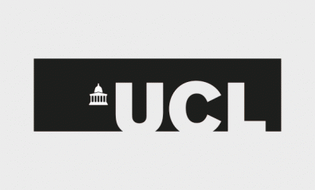

# Welcome
Innovation is a fundamental concept of our reality. Understanding innovation, whether in biological or emergent systems, such as our economy, is key in making sustainable progress.

We are optimising economic innovation.

We are accelerating the innovation process by creating new tools and methods using the best knowledge there is to explain innovation.

## Projects

* **Team Building**
* **The Innovation Estimate**: Strategic framework for analysing ventures.

## Leadership
Leadership teams consists of Prof Philip Treleaven and Sirvan Almasi (advised by Prof William J.Knottenbelt).